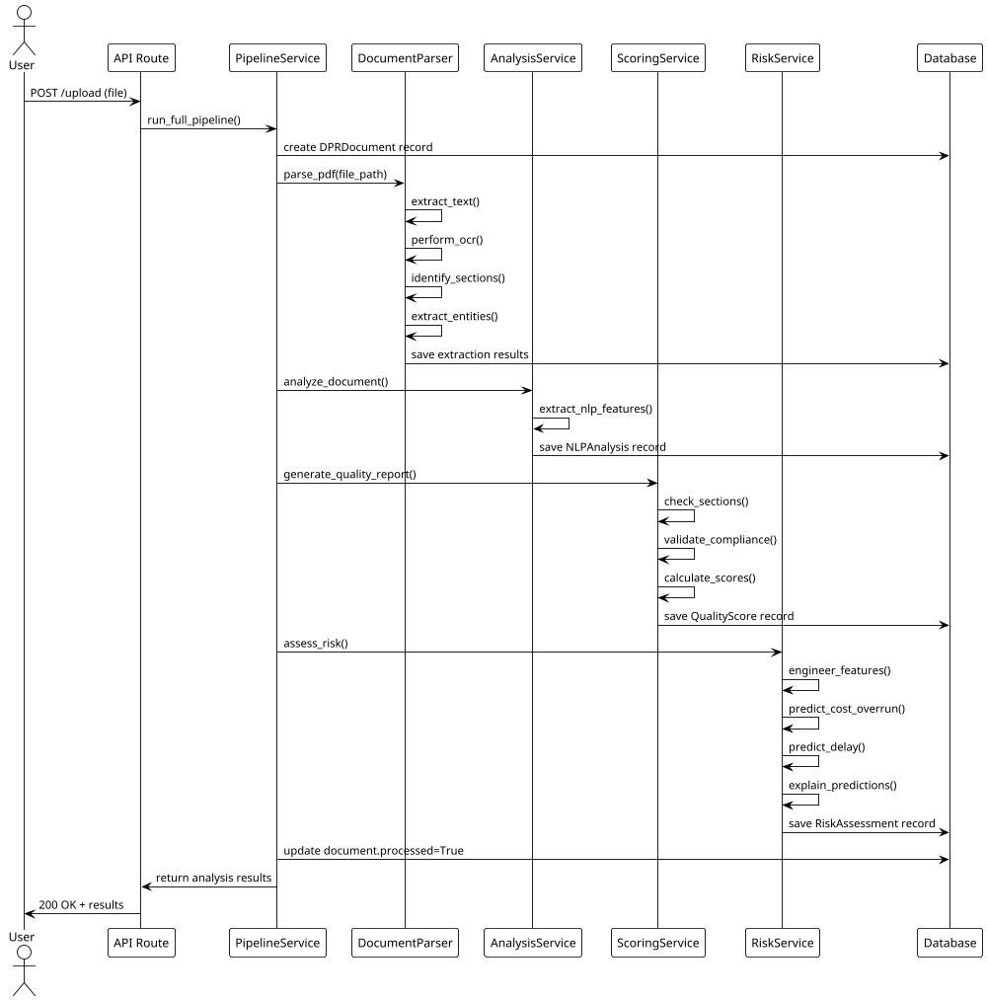
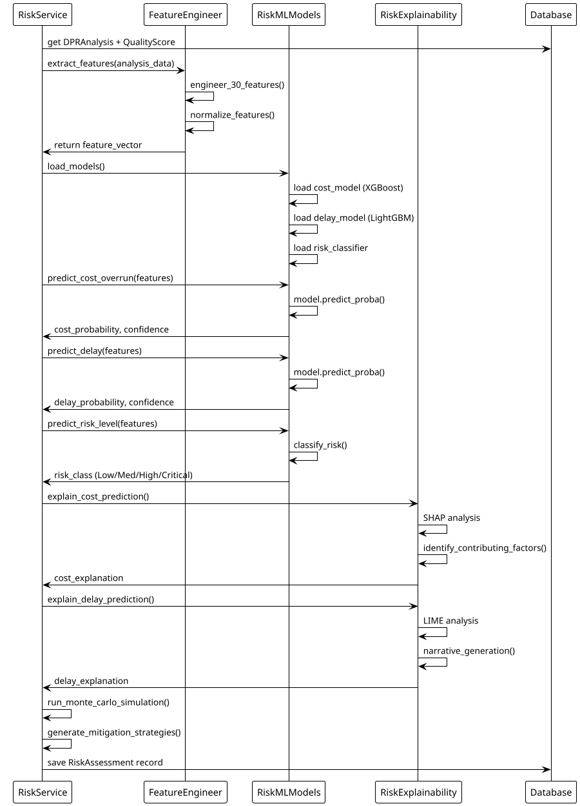
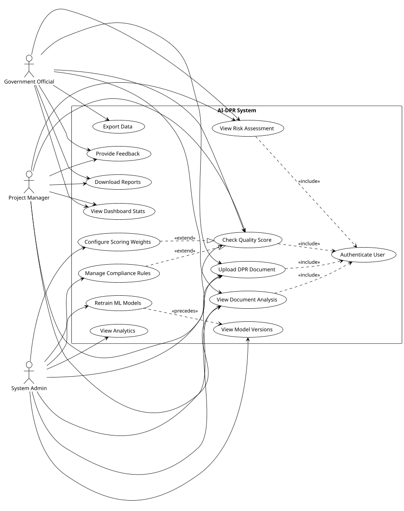
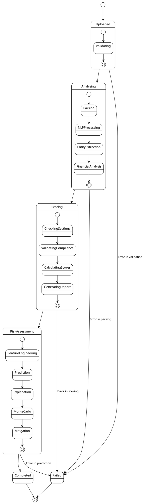
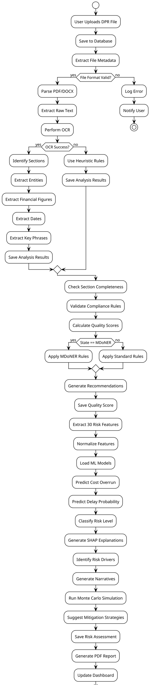

# AI-DPR System - Complete UML Diagrams

## 1. CLASS DIAGRAM

```plantuml
@startuml ClassDiagram
!theme plain
scale 1000 width

namespace Models {
    class DPRDocument {
        -id: int
        -file_name: str
        -file_path: str
        -file_size_kb: float
        -file_format: str
        -state_id: int
        -state_name: str
        -project_type: str
        -project_name: str
        -project_cost_crores: float
        -total_pages: int
        -total_words: int
        -upload_date: datetime
        -processed: bool
        -processing_status: str
        +get_state_ref()
        +get_analysis()
        +get_quality_score()
        +get_risk_assessment()
    }

    class DPRAnalysis {
        -id: int
        -document_id: int
        -sections_found: int
        -sections_total: int
        -sections_data: JSON
        -entities_data: JSON
        -organizations_count: int
        -locations_count: int
        -dates_count: int
        -financial_figures: JSON
        -total_cost_extracted: float
        -text_statistics: JSON
        -key_phrases: JSON
        -table_analysis: JSON
        -analysis_date: datetime
    }

    class QualityScore {
        -id: int
        -document_id: int
        -composite_score: float
        -grade: str
        -section_completeness_score: float
        -technical_depth_score: float
        -financial_accuracy_score: float
        -compliance_score: float
        -risk_assessment_quality_score: float
        -violations: JSON
        -warnings: JSON
        -recommendations: JSON
        -scored_date: datetime
    }

    class RiskAssessment {
        -id: int
        -document_id: int
        -overall_risk_level: str
        -cost_overrun_probability: float
        -delay_probability: float
        -model_confidence: float
        -cost_prediction: JSON
        -delay_prediction: JSON
        -monte_carlo_results: JSON
        -explanation: JSON
        -top_risk_drivers: JSON
        -mitigation_strategies: JSON
        -assessed_date: datetime
    }

    class State {
        -id: int
        -name: str
        -code: str
        -is_mdoner: bool
        -region: str
        -terrain: str
        -risk_factor: float
        -special_provisions: JSON
        -priority_sectors: JSON
    }

    class ComplianceRule {
        -id: int
        -rule_code: str
        -category: str
        -title: str
        -severity: str
        -applies_to: str
        -state_code: str
        -threshold_value: float
        -is_active: bool
    }

    class UserFeedback {
        -id: int
        -document_id: int
        -feedback_type: str
        -rating: int
        -is_accurate: bool
        -user_comment: str
        -corrected_score: float
        -corrected_risk_level: str
        -created_at: datetime
    }

    class TrainingData {
        -id: int
        -document_id: int
        -features: JSON
        -labels: JSON
        -metadata_info: JSON
        -is_user_corrected: bool
        -source: str
        -created_at: datetime
    }

    class ModelVersion {
        -id: int
        -version: int
        -real_samples_used: int
        -synthetic_samples_used: int
        -total_samples_used: int
        -cost_model_metrics: JSON
        -delay_model_metrics: JSON
        -risk_model_metrics: JSON
        -feature_importance: JSON
        -trained_at: datetime
    }

    DPRDocument --> DPRAnalysis : has
    DPRDocument --> QualityScore : has
    DPRDocument --> RiskAssessment : has
    DPRDocument --> UserFeedback : receives
    DPRDocument --> State : belongs_to
    DPRDocument --> TrainingData : generates
    State --> ComplianceRule : has
}

namespace Processing {
    class DocumentParser {
        -pdf_extractor: PDFExtractor
        -ocr_engine: OCREngine
        -nlp_processor: NLPProcessor
        -table_extractor: TableExtractor
        +parse_pdf(file_path)
        +extract_text()
        +parse_tables()
        +perform_ocr()
    }

    class PDFExtractor {
        -pdf_path: str
        +extract_text_from_pdf()
        +get_page_count()
        +extract_images()
    }

    class OCREngine {
        -model: pytesseract
        +recognize_text_from_image()
        +extract_handwritten_text()
    }

    class NLPProcessor {
        -section_patterns: dict
        -entity_patterns: dict
        +identify_sections()
        +extract_named_entities()
        +extract_financial_figures()
        +extract_dates()
        +extract_key_phrases()
        +calculate_text_statistics()
    }

    class TableExtractor {
        +identify_tables()
        +extract_table_data()
        +convert_to_json()
    }

    DocumentParser --> PDFExtractor : uses
    DocumentParser --> OCREngine : uses
    DocumentParser --> NLPProcessor : uses
    DocumentParser --> TableExtractor : uses
}

namespace Scoring {
    class QualityScorer {
        -section_checker: SectionChecker
        -compliance_engine: ComplianceEngine
        +score_completeness()
        +score_technical_depth()
        +score_financial_accuracy()
        +score_compliance()
        +generate_recommendations()
        +calculate_composite_score()
    }

    class SectionChecker {
        -required_sections: dict
        +check_section_presence()
        +check_section_quality()
        +check_word_count()
        +verify_mandatory_sections()
    }

    class ComplianceEngine {
        -central_rules: dict
        -mdoner_rules: dict
        -state_rules: dict
        +validate_central_compliance()
        +validate_mdoner_compliance()
        +validate_state_compliance()
        +generate_compliance_report()
    }

    class QualityReport {
        -scores: dict
        -violations: list
        -warnings: list
        -recommendations: list
        +generate_pdf_report()
        +export_json()
    }

    QualityScorer --> SectionChecker : uses
    QualityScorer --> ComplianceEngine : uses
    QualityScorer --> QualityReport : generates
}

namespace RiskPrediction {
    class RiskAnalyzer {
        -feature_engineer: FeatureEngineer
        -ml_models: RiskMLModels
        -explainability: RiskExplainability
        +assess_project_risk()
        +predict_cost_overrun()
        +predict_delay()
        +classify_overall_risk()
        +run_monte_carlo_simulation()
    }

    class FeatureEngineer {
        -feature_list: list
        +extract_features()
        +engineer_features()
        +normalize_features()
        +handle_missing_values()
    }

    class RiskMLModels {
        -cost_model: XGBoost
        -delay_model: LightGBM
        -risk_classifier: RandomForest
        +load_models()
        +predict_cost_overrun()
        +predict_delay()
        +predict_risk_level()
        +get_feature_importance()
    }

    class RiskExplainability {
        -shap_explainer: SHAP
        -lime_explainer: LIME
        +explain_cost_prediction()
        +explain_delay_prediction()
        +explain_risk_classification()
        +generate_narrative_explanation()
        +identify_risk_drivers()
    }

    RiskAnalyzer --> FeatureEngineer : uses
    RiskAnalyzer --> RiskMLModels : uses
    RiskAnalyzer --> RiskExplainability : uses
}

namespace Services {
    class AnalysisService {
        +analyze_document(file_path, state)
        +extract_nlp_features()
        +save_analysis_results()
    }

    class ScoringService {
        +generate_quality_report(document_id)
        +update_quality_score()
        +export_report_pdf()
    }

    class RiskService {
        +assess_risk(document_id)
        +predict_cost_overrun()
        +predict_delays()
        +generate_risk_mitigation()
    }

    class PipelineService {
        +run_full_pipeline(document_id, file_path, state)
        +orchestrate_analysis()
        +orchestrate_scoring()
        +orchestrate_risk_assessment()
        +handle_errors()
    }

    class LearningService {
        -training_data: list
        -model_versions: list
        +collect_training_samples()
        +retrain_models()
        +evaluate_models()
        +update_model_version()
    }

    class AuthService {
        +verify_password()
        +hash_password()
        +create_access_token()
        +decode_access_token()
        +get_current_user()
    }

    class PDFGeneratorService {
        +generate_dpr_pdf()
        +add_analysis_results()
        +add_quality_scores()
        +add_risk_assessment()
    }

    class SHAPService {
        +explain_predictions()
        +generate_shap_plots()
        +extract_feature_importance()
    }

    PipelineService --> AnalysisService : orchestrates
    PipelineService --> ScoringService : orchestrates
    PipelineService --> RiskService : orchestrates
}

namespace API {
    class UploadRoute {
        +POST /upload
        +GET /documents
        +GET /documents/{id}
    }

    class AnalysisRoute {
        +POST /analyze
        +GET /analysis/{id}
    }

    class ScoringRoute {
        +POST /score
        +GET /scores/{id}
    }

    class RiskRoute {
        +POST /risk-assess
        +GET /risk/{id}
    }

    class DashboardRoute {
        +GET /dashboard/stats
        +GET /dashboard/documents-by-state
        +GET /dashboard/risk-distribution
    }

    class LearningRoute {
        +GET /learning/model-versions
        +POST /learning/retrain
        +GET /learning/metrics
    }

    class AuthRoute {
        +POST /login
        +POST /register
        +POST /logout
    }

    class DocumentsRoute {
        +GET /documents
        +GET /documents/{id}/analysis
        +GET /documents/{id}/quality
        +GET /documents/{id}/risk
    }

    class ExplainabilityRoute {
        +POST /explain/cost-overrun
        +POST /explain/delay
        +POST /explain/risk-classification
    }

    class WebSocketRoute {
        +WS /ws/{document_id}
    }
}

UploadRoute -.-> AnalysisService : uses
AnalysisRoute -.-> AnalysisService : uses
ScoringRoute -.-> ScoringService : uses
RiskRoute -.-> RiskService : uses
LearningRoute -.-> LearningService : uses
ExplainabilityRoute -.-> RiskService : uses

@enduml
```



---

## 2. COMPONENT DIAGRAM

```plantuml
@startuml ComponentDiagram
!theme plain
scale 800 width

package "Frontend Layer" {
    component "Web Dashboard" as WebDash [
        HTML/CSS/JavaScript
        Chart.js 4.4
    ]
}

package "API Layer" {
    component "FastAPI Server" as FastAPI_Server [
        REST API
        WebSocket Support
        CORS Enabled
    ]
    
    component "API Routes" as Routes [
        Upload
        Analysis
        Scoring
        Risk Assessment
        Dashboard
        Learning
        Auth
        Documents
        Explainability
        WebSocket
    ]
}

package "Business Logic Layer" {
    component "Document Processing" as DocProc [
        PDF Extraction
        OCR Engine
        NLP Processing
        Table Extraction
    ]
    
    component "Quality Scoring" as QualityScore_Comp [
        Section Checker
        Compliance Engine
        Quality Report Generator
    ]
    
    component "Risk Prediction" as RiskPred [
        Feature Engineering
        ML Models (XGBoost, LightGBM)
        Explainability (SHAP/LIME)
        Monte Carlo Simulation
    ]
    
    component "Learning System" as Learning_Comp [
        Training Data Collection
        Model Retraining
        Evaluation Metrics
    ]
    
    component "Authentication" as Auth_Comp [
        Password Management
        Token Generation
        User Verification
    ]
}

package "Data Layer" {
    component "PostgreSQL Database" as PostgreSQL_DB [
        DPR Documents
        Analysis Results
        Quality Scores
        Risk Assessments
        Training Data
        Model Versions
        User Feedback
        Analytics Logs
    ]
    
    component "Firebase" as Firebase_DB [
        User Management
        Real-time Data
        Configuration
    ]
}

package "Utility Layer" {
    component "PDF Generator" as PDF_Gen [
        Report Generation
        Data Formatting
    ]
    
    component "WebSocket Manager" as WS_Manager [
        Real-time Updates
        Progress Tracking
    ]
    
    component "Logging & Monitoring" as Logging_Comp [
        Loguru
        Analytics Tracking
    ]
}

package "ML Models Storage" {
    component "Model Repository" as ModelRepo [
        XGBoost Cost Model
        LightGBM Delay Model
        RF Risk Classifier
        SHAP Explainers
    ]
}

' Connections
WebDash --> FastAPI_Server : HTTP/WebSocket

FastAPI_Server --> Routes : routes
Routes --> DocProc : uses
Routes --> QualityScore_Comp : uses
Routes --> RiskPred : uses
Routes --> Learning_Comp : uses
Routes --> Auth_Comp : uses

DocProc --> PostgreSQL_DB : reads/writes
QualityScore_Comp --> PostgreSQL_DB : reads/writes
RiskPred --> PostgreSQL_DB : reads/writes
RiskPred --> ModelRepo : loads
Learning_Comp --> PostgreSQL_DB : reads/writes
Learning_Comp --> ModelRepo : updates

Auth_Comp --> Firebase_DB : verifies

PDF_Gen --> PostgreSQL_DB : reads
WS_Manager --> FastAPI_Server : broadcasts
Logging_Comp --> PostgreSQL_DB : logs

@enduml
```

---

## 3. DEPLOYMENT DIAGRAM

```plantuml
@startuml DeploymentDiagram
!theme plain
scale 800 width

artifact "Client Browser" as Browser {
    component "Web UI" as WebUI [
        Dashboard Interface
        Chart Visualization
    ]
}

artifact "Docker Container - AI-DPR" as Container {
    node "FastAPI Application" as FastApp_Node {
        component "API Server" as ApiServer
        component "Business Logic" as BizLogic
        component "Services" as Services
    }
}

artifact "Database Tier" {
    database "PostgreSQL DB" as DB_PG [
        Persistent Storage
        ACID Compliance
    ]
    
    database "Firebase" as DB_Firebase [
        User Data
        Real-time Config
    ]
}

artifact "External Services" {
    component "Tesseract OCR" as Tesseract_OCR
    component "spaCy NLP" as SpaCy_NLP
    component "XGBoost/LightGBM" as ML_Models
}

artifact "Storage" {
    folder "Uploads" as Uploads_Folder [
        PDF Files
        DOCX Files
    ]
    
    folder "Models" as Models_Folder [
        Trained Models
        ML Artifacts
    ]
    
    folder "Reports" as Reports_Folder [
        Generated PDFs
        Analytics
    ]
}

' Connections
Browser --> ApiServer : HTTPS/WebSocket
ApiServer --> BizLogic : calls
BizLogic --> Services : uses
Services --> DB_PG : queries
Services --> DB_Firebase : queries
Services --> Tesseract_OCR : calls
Services --> SpaCy_NLP : calls
Services --> ML_Models : loads
Services --> Uploads_Folder : reads
Services --> Models_Folder : reads
Services --> Reports_Folder : writes

@enduml
```

---

## 4. SEQUENCE DIAGRAM - Full Pipeline



---

## 5. SEQUENCE DIAGRAM - Risk Prediction



---

## 6. USE CASE DIAGRAM



---

## 7. STATE DIAGRAM - Document Processing



---

## 8. ACTIVITY DIAGRAM - Full Analysis Pipeline



---

## 9. PACKAGE DIAGRAM

```plantuml
@startuml PackageDiagram
!theme plain
scale 900 width

package "app" {
    package "api" {
        package "routes" {
            component "upload.py"
            component "analysis.py"
            component "scoring.py"
            component "risk.py"
            component "dashboard.py"
            component "learning.py"
            component "auth.py"
            component "documents.py"
            component "explainability.py"
            component "ws.py"
        }
        component "dependencies.py"
    }
    
    package "models" {
        component "database.py"
        component "db_models.py"
        component "schemas.py"
    }
    
    package "modules" {
        package "document_parser" {
            component "nlp_processor.py"
            component "ocr_engine.py"
            component "pdf_extractor.py"
            component "table_extractor.py"
        }
        
        package "quality_scorer" {
            component "compliance_engine.py"
            component "quality_report.py"
            component "section_checker.py"
        }
        
        package "risk_predictor" {
            component "explainability.py"
            component "feature_engineer.py"
            component "ml_models.py"
            component "risk_analyzer.py"
        }
    }
    
    package "services" {
        component "analysis_service.py"
        component "auth_service.py"
        component "db_service.py"
        component "learning_service.py"
        component "pdf_generator.py"
        component "pipeline_service.py"
        component "risk_service.py"
        component "scoring_service.py"
        component "seed.py"
        component "shap_service.py"
        component "websocket_manager.py"
    }
}

package "config" {
    component "firebase_config.py"
    component "settings.py"
}

package "ml" {
    component "train_models.py"
}

package "frontend" {
    component "index.html"
    package "css" {
        component "styles.css"
    }
    package "js" {
        component "app.js"
    }
}

package "data" {
    component "indian_states.json"
    package "compliance_rules" {
        component "mdoner_rules.json"
    }
    package "dpr_templates" {
        component "standard_template.json"
    }
}

"api/routes" ..|> "services" : uses
"api/routes" ..|> "models" : uses
"services" ..|> "modules" : uses
"modules" ..|> "models" : uses
"api" ..|> "config" : uses

@enduml
```



---

## 10. ERD (Entity-Relationship Diagram)

```plantuml
@startuml ERDiagram
!theme plain
scale 1000 width

entity "DPRDocument" as doc {
    *id : INT <<PK>>
    file_name : VARCHAR(255)
    file_path : VARCHAR(500)
    file_size_kb : FLOAT
    state_id : INT <<FK>>
    state_name : VARCHAR(100)
    project_type : VARCHAR(100)
    project_cost_crores : FLOAT
    upload_date : DATETIME
    processed : BOOLEAN
}

entity "State" as state {
    *id : INT <<PK>>
    name : VARCHAR(100)
    code : VARCHAR(10)
    is_mdoner : BOOLEAN
    region : VARCHAR(50)
    risk_factor : FLOAT
}

entity "DPRAnalysis" as analysis {
    *id : INT <<PK>>
    document_id : INT <<FK>>
    sections_found : INT
    sections_data : JSON
    entities_data : JSON
    financial_figures : JSON
    analysis_date : DATETIME
}

entity "QualityScore" as quality {
    *id : INT <<PK>>
    document_id : INT <<FK>>
    composite_score : FLOAT
    grade : VARCHAR(5)
    compliance_score : FLOAT
    violations : JSON
    scored_date : DATETIME
}

entity "RiskAssessment" as risk {
    *id : INT <<PK>>
    document_id : INT <<FK>>
    overall_risk_level : VARCHAR(20)
    cost_overrun_probability : FLOAT
    delay_probability : FLOAT
    monte_carlo_results : JSON
    assessed_date : DATETIME
}

entity "UserFeedback" as feedback {
    *id : INT <<PK>>
    document_id : INT <<FK>>
    feedback_type : VARCHAR(50)
    rating : INT
    user_comment : TEXT
    corrected_score : FLOAT
    created_at : DATETIME
}

entity "TrainingData" as training {
    *id : INT <<PK>>
    document_id : INT <<FK>>
    features : JSON
    labels : JSON
    is_user_corrected : BOOLEAN
    created_at : DATETIME
}

entity "ComplianceRule" as compliance {
    *id : INT <<PK>>
    rule_code : VARCHAR(50)
    category : VARCHAR(100)
    title : VARCHAR(300)
    severity : VARCHAR(20)
    state_code : VARCHAR(10)
    is_active : BOOLEAN
}

entity "ModelVersion" as model_ver {
    *id : INT <<PK>>
    version : INT
    real_samples_used : INT
    synthetic_samples_used : INT
    cost_model_metrics : JSON
    trained_at : DATETIME
}

entity "AnalyticsLog" as analytics {
    *id : INT <<PK>>
    action : VARCHAR(100)
    document_id : INT <<FK>>
    state : VARCHAR(100)
    duration_ms : FLOAT
    timestamp : DATETIME
}

doc ||--o| state : "belongs_to"
doc ||--o| analysis : "has"
doc ||--o| quality : "has"
doc ||--o| risk : "has"
doc o{--|| feedback : "receives"
doc o{--|| training : "generates"
doc o{--|| analytics : "generates"
state o{--|| compliance : "has"

@enduml
```

---

## 11. TIMING DIAGRAM - Document Processing Timeline

```plantuml
@startuml TimingDiagram
!theme plain
scale 1000 width

robust "User Request"
concise "Document Parser" as Parser
concise "NLP Processor" as NLP
concise "Quality Scorer" as Scorer
concise "Risk Predictor" as Predictor
concise "Database" as Database

@0
User is Requesting
Parser is Idle
NLP is Idle
Scorer is Idle
Predictor is Idle
Database is Idle

@5
Parser is Processing
User is Waiting

@15
Parser is Done
NLP is Processing

@25
NLP is Done
Scorer is Processing

@35
Scorer is Done
Predictor is Processing

@50
Predictor is Done
Database is Saving

@55
Database is Done
User is Receiving_Results
User is {endLife}

@enduml
```

---

## 12. OBJECT DIAGRAM - Example Instance

```plantuml
@startuml ObjectDiagram
!theme plain
scale 800 width

object doc1 : DPRDocument {
    id = 1001
    file_name = "Highway_Project_Delhi.pdf"
    state_id = 7
    state_name = "Delhi"
    project_cost_crores = 450.5
    processed = true
    processing_status = "completed"
}

object state1 : State {
    id = 7
    name = "Delhi"
    is_mdoner = false
    risk_factor = 3.5
}

object analysis1 : DPRAnalysis {
    id = 5001
    document_id = 1001
    sections_found = 12
    sections_total = 14
    organizations_count = 8
    financial_figures = {amount: [450.5, 120.3]}
}

object quality1 : QualityScore {
    id = 3001
    document_id = 1001
    composite_score = 78.5
    grade = "A"
    compliance_score = 82.0
}

object risk1 : RiskAssessment {
    id = 2001
    document_id = 1001
    overall_risk_level = "Medium"
    cost_overrun_probability = 0.35
    delay_probability = 0.42
}

object feedback1 : UserFeedback {
    id = 4001
    document_id = 1001
    feedback_type = "correction"
    rating = 4
    is_accurate = true
}

doc1 --> state1 : belongs_to
doc1 --> analysis1 : generates
doc1 --> quality1 : generates
doc1 --> risk1 : generates
doc1 --> feedback1 : receives

@enduml
```

---

## 13. INTERACTION OVERVIEW DIAGRAM

```plantuml
@startuml InteractionOverview
!theme plain
scale 900 width

frame File Upload & Processing {
    sd User Upload {
        participant User
        participant API
        participant Database
        User -> API: POST /upload
        API -> Database: Save DPRDocument
    }
}

frame Document Analysis {
    sd NLP Analysis {
        participant Parser
        participant NLP
        participant Database
        Parser -> NLP: extract_sections()
        NLP -> Database: save_analysis()
    }
}

frame Quality Scoring {
    sd Scoring {
        participant Scorer
        participant Compliance
        participant Database
        Scorer -> Compliance: validate_rules()
        Compliance -> Database: save_quality_score()
    }
}

frame Risk Assessment {
    sd Risk {
        participant RiskAnalyzer
        participant MLModels
        participant Database
        RiskAnalyzer -> MLModels: predict()
        MLModels -> Database: save_risk_assessment()
    }
}

frame Report Generation {
    sd Reporting {
        participant PDFGenerator
        participant User
        PDFGenerator -> User: send_report()
    }
}

@enduml
```

---

## 14. SWIMLANE DIAGRAM - Process Flow

```plantuml
@startuml SwimlaneActivityDiagram
!theme plain
scale 1000 width

|#FFF||Government Official||System||Database||
start
|Government Official|
:Upload DPR File;
|System|
:Receive & Validate File;
if (Valid?) then (yes)
    |Database|
    :Save Document Record;
    |System|
    :Parse Document;
    :Extract Text & Metadata;
    |Database|
    :Save Analysis Data;
    |System|
    :Calculate Quality Score;
    if (All Sections Present?) then (yes)
        :Validate Compliance;
    else (no)
        :Flag Missing Sections;
    endif
    |Database|
    :Save Quality Score;
    |System|
    :Assess Risk;
    :Run ML Predictions;
    :Generate Explanations;
    |Database|
    :Save Risk Assessment;
    |System|
    :Generate PDF Report;
    |Government Official|
    :Download Report;
else (no)
    |Government Official|
    :Show Error;
endif
stop

@enduml
```

---

## Summary of UML Diagrams Provided:

1. **Class Diagram** - All database models, services, and processing modules
2. **Component Diagram** - System architecture with all major components
3. **Deployment Diagram** - Physical deployment topology
4. **Sequence Diagram (Pipeline)** - Complete document analysis flow
5. **Sequence Diagram (Risk)** - Risk prediction workflow
6. **Use Case Diagram** - All system interactions
7. **State Diagram** - Document processing states
8. **Activity Diagram** - Full pipeline activities
9. **Package Diagram** - Project directory structure
10. **ERD** - Database relationships
11. **Timing Diagram** - Process timeline
12. **Object Diagram** - Example instances
13. **Interaction Overview** - High-level interactions
14. **Swimlane Diagram** - Process flow by actor

All diagrams are in **PlantUML** format and can be rendered using:
- PlantUML online editor (www.plantuml.com/plantuml/uml)
- VS Code extensions (PlantUML extension)
- Local PlantUML installation
